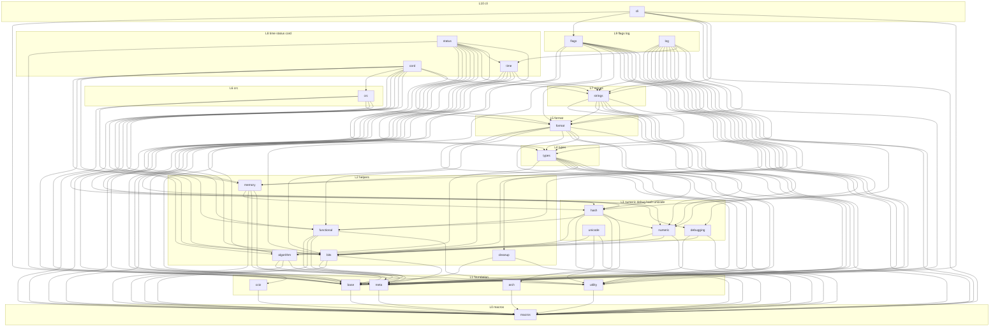

turbo
=============================

[中文版](./README_CN.md)

C++17 foundation library: vocabulary types, strings, time, status, log, flags/CLI, unicode, and related helpers. Built with [kmcmake](https://github.com/koomx/kmcmake). User config lives in `cmake/`; do not edit `kmcmake/`.

Public API summary for humans and agents: [`turbo/skills.h`](turbo/skills.h). Style and edit rules: [`docs/c_cpp_project_rules.md`](docs/c_cpp_project_rules.md).

## Build

Presets in [`CMakePresets.json`](CMakePresets.json) inherit `base`, which sets `KMCMAKE_USE_CPM=ON`. Test/benchmark packages (GoogleTest, google/benchmark) are listed in [`cmake/turbo_cpm.cmake`](cmake/turbo_cpm.cmake) and fetched only when those options are on.

### Environment

- Linux / macOS / Windows (MSVC + Ninja recommended)
- CMake >= 3.20
- GCC >= 9.4 / Clang >= 12 / MSVC (VS 2022+)
- Optional: `ninja` on PATH for `--preset=ninja` and `--preset=ci`

### Configure and compile

From the repository root:

```bash
# Unix Makefiles → build/
cmake --preset=default
cmake --build build -j$(nproc)

# Ninja → build-ninja/
cmake --preset=ninja
cmake --build build-ninja -j$(nproc)

# Tests + benchmarks (Ninja) → build-ninja/
cmake --preset=ci
cmake --build build-ninja --parallel
```

`CMAKE_CXX_STANDARD` is 17 ([`cmake/turbo_user_option.cmake`](cmake/turbo_user_option.cmake)).

### Tests

```bash
ctest --test-dir build
# or, after ninja / ci presets:
ctest --test-dir build-ninja --output-on-failure
```

## Modules

Sources live under `turbo/<module>/`. Cross-module `#include <turbo/<other>/...>` is an allow-list in [`turbo/module_deps.toml`](turbo/module_deps.toml). The graph below is that allow-list by layer (L0–L10). Same-module includes are always allowed. There are no cycles.



Refresh measured edges or enforce the allow-list:

```bash
python3 scripts/check_module_deps.py list-all
python3 scripts/check_module_deps.py list <module> -v
python3 scripts/check_module_deps.py check
```

Install the pre-commit hook (staged turbo sources only):

```bash
git config core.hooksPath scripts/git-hooks
```

Skip once: `SKIP_MODULE_DEPS=1 git commit ...`

## CI

Workflow: [`.github/workflows/ci.yml`](.github/workflows/ci.yml) (`koomx/x-ci` reusable workflow). Configure via `python3 scripts/ci_configure.py`.

Currently enabled jobs:

- `std20-ubuntu24-amd64`
- `macos-arm64`
- `windows`

**Linux ARM is skipped.** GitHub-hosted CI can hang; do not treat a stuck GitHub run as a signal that the other jobs failed.
