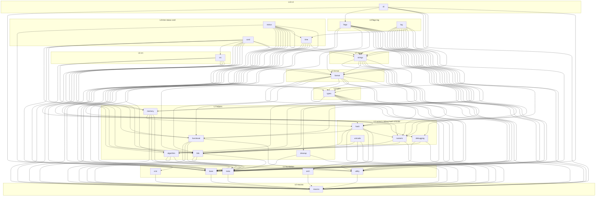

turbo
=============================

[English](./README.md)

C++17 基础库：类型、字符串、时间、status、log、flags/CLI、unicode 及相关辅助。构建框架为 [kmcmake](https://github.com/koomx/kmcmake)。用户配置在 `cmake/`；不要改 `kmcmake/`。

公开 API 摘要（给人与 AI）：[`turbo/skills.h`](turbo/skills.h)。风格与改动纪律：[`docs/c_cpp_project_rules.md`](docs/c_cpp_project_rules.md)。

## 构建

[`CMakePresets.json`](CMakePresets.json) 中的 preset 继承 `base`，打开 `KMCMAKE_USE_CPM=ON`。测试/benchmark 包（GoogleTest、google/benchmark）在 [`cmake/turbo_cpm.cmake`](cmake/turbo_cpm.cmake)，仅在对应选项开启时拉取。

### 环境

- Linux / macOS / Windows（推荐 MSVC + Ninja）
- CMake >= 3.20
- GCC >= 9.4 / Clang >= 12 / MSVC（VS 2022+）
- 可选：使用 `--preset=ninja` / `--preset=ci` 时 PATH 中需有 `ninja`

### 配置与编译

在仓库根目录：

```bash
# Unix Makefiles → build/
cmake --preset=default
cmake --build build -j$(nproc)

# Ninja → build-ninja/
cmake --preset=ninja
cmake --build build-ninja -j$(nproc)

# 测试 + benchmark（Ninja）→ build-ninja/
cmake --preset=ci
cmake --build build-ninja --parallel
```

`CMAKE_CXX_STANDARD` 为 17（[`cmake/turbo_user_option.cmake`](cmake/turbo_user_option.cmake)）。

### 测试

```bash
ctest --test-dir build
# ninja / ci preset 之后：
ctest --test-dir build-ninja --output-on-failure
```

## 模块

源码在 `turbo/<module>/`。跨模块 `#include <turbo/<other>/...>` 以 [`turbo/module_deps.toml`](turbo/module_deps.toml) 的 allow-list 为准。下图按该文件的 L0–L10 分层；同模块 include 始终允许；无环。



刷新实测边或检查 allow-list：

```bash
python3 scripts/check_module_deps.py list-all
python3 scripts/check_module_deps.py list <module> -v
python3 scripts/check_module_deps.py check
```

安装 pre-commit（只扫已暂存的 turbo 源文件）：

```bash
git config core.hooksPath scripts/git-hooks
```

单次跳过：`SKIP_MODULE_DEPS=1 git commit ...`

## CI

工作流：[`.github/workflows/ci.yml`](.github/workflows/ci.yml)（`koomx/x-ci` 可复用工作流）。配置命令：`python3 scripts/ci_configure.py`。

当前启用的作业：

- `std20-ubuntu24-amd64`
- `macos-arm64`
- `windows`

**Linux ARM 当前跳过。** GitHub 上的 CI 会卡住；卡住不代表其它已启用作业失败。
